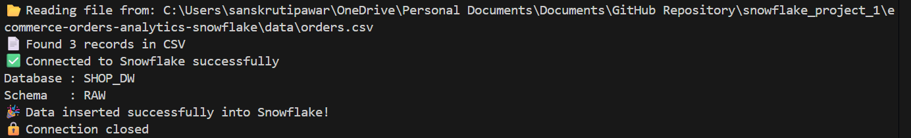
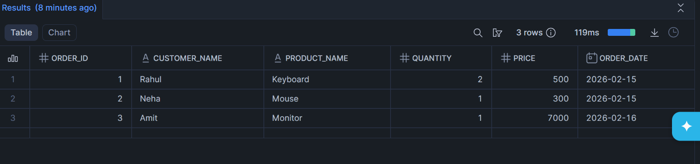

# 🛒 E-Commerce Orders Analytics  
### Snowflake Data Warehouse Project (RAW → STAGE → REPORT)

---

## 📌 Project Overview

This project demonstrates a complete **Data Ingestion and Transformation Pipeline** using:

- Python
- Pandas
- Snowflake
- SQL

The system loads order data from a CSV file into Snowflake and builds a structured 3-layer Data Warehouse architecture:

RAW → STAGE → REPORT


This project simulates a real-world Data Engineering workflow.

---

# 🏗 Architecture


orders.csv
↓
Python (Snowflake Connector + Pandas)
↓
RAW.ORDERS_RAW
↓
STAGE.ORDERS_CLEAN
↓
REPORT.DAILY_SALES


---

# 📂 Project Structure


ecommerce-orders-analytics-snowflake
│
├── data/
│ └── orders.csv
│
├── python/
│ ├── insert_orders.py
│ └── config.py
│
├── images/
│ ├── terminal_output.png
│ ├── raw_output.png
│ ├── stage_output.png
│ └── report_output.png
│
└── README.md


---

# 🛠 Technologies Used

- Python 3.x
- Snowflake Cloud Data Warehouse
- Snowflake Connector for Python
- Pandas
- SQL

---

# 🗄 Database Design

## 🔹 RAW Layer

**Table:** `RAW.ORDERS_RAW`

Stores raw ingested data directly from CSV.

Columns:
- ORDER_ID
- CUSTOMER_NAME
- PRODUCT_NAME
- QUANTITY
- PRICE
- ORDER_DATE

---

## 🔹 STAGE Layer

**Table:** `STAGE.ORDERS_CLEAN`

Adds transformation logic:

- TOTAL_AMOUNT = QUANTITY × PRICE

---

## 🔹 REPORT Layer

**Table:** `REPORT.DAILY_SALES`

Aggregated business metrics:

- SALES_DATE
- TOTAL_ORDERS
- TOTAL_REVENUE

---

# 🚀 How to Run This Project

## 1️⃣ Install Dependencies

```bash
pip install snowflake-connector-python pandas

2️⃣ Configure Snowflake Credentials

Update config.py:

SNOWFLAKE_CONFIG = {
    "user": "your_username",
    "password": "your_password",
    "account": "your_account",
    "warehouse": "your_warehouse",
    "database": "SHOP_DW",
    "schema": "RAW",
    "role": "ACCOUNTADMIN"
}

3️⃣ Run the Ingestion Script

From project root:

python python/insert_orders.py

💻 Terminal Output

After successful execution:

📂 Reading file from: .../data/orders.csv
📄 Found 3 records in CSV
✅ Connected to Snowflake successfully
Database : SHOP_DW
Schema   : RAW
🎉 Data inserted successfully into Snowflake!
🔒 Connection closed





📊 Sample Final Report Output



